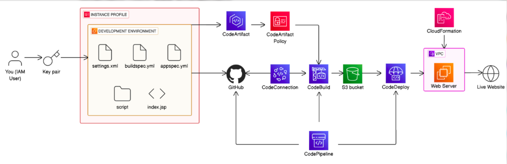

# AWS CI/CD Pipeline for Java Web Application

A complete CI/CD pipeline implementation using AWS services to automatically build, test, and deploy a Java web application to EC2 instances.

## 🏗️ Architecture Overview



This project implements a comprehensive CI/CD pipeline using the following AWS services:

- **AWS CodeCommit/GitHub**: Source code repository
- **AWS CodeArtifact**: Maven package repository for dependency management
- **AWS CodeBuild**: Continuous integration service for building and testing
- **AWS CodeDeploy**: Automated deployment service
- **AWS CodePipeline**: Orchestrates the entire CI/CD workflow
- **Amazon EC2**: Target deployment environment running Tomcat and Apache HTTP Server
- **Amazon S3**: Artifact storage for build outputs
- **AWS IAM**: Identity and access management for service permissions

## 📋 Project Structure

```
CI-CD-AWS/
├── src/
│   └── main/
│       └── webapp/
│           ├── WEB-INF/
│           └── index.jsp
├── scripts/
│   ├── install_dependencies.sh
│   ├── start_server.sh
│   └── stop_server.sh
├── images/
│   ├── architecture/
│   │   └── aws-cicd-architecture.png
│   └── aws-console/
│       ├── 01-initial-setup.png
│       ├── 02-iam-roles-setup.png
│       ├── 03-codeartifact-setup.png
│       ├── 04-s3-bucket-setup.png
│       ├── 05-ec2-instance-setup.png
│       ├── 06-codebuild-project.png
│       ├── 07-codebuild-configuration.png
│       ├── 08-codedeploy-application.png
│       ├── 09-codedeploy-deployment-group.png
│       ├── 10-codepipeline-setup.png
│       ├── 11-codepipeline-configuration.png
│       └── 12-pipeline-execution-success.png
├── appspec.yml
├── buildspec.yml
├── pom.xml
├── settings.xml
└── README.md
```

## 🚀 Features

- **Automated CI/CD Pipeline**: End-to-end automation from code commit to deployment
- **Maven Integration**: Uses AWS CodeArtifact for dependency management
- **Blue-Green Deployment**: Safe deployment strategy with CodeDeploy
- **Infrastructure as Code**: Configuration files for reproducible deployments
- **Monitoring & Logging**: Built-in AWS CloudWatch integration
- **Scalable Architecture**: Easy to extend for multiple environments

## 🛠️ Prerequisites

Before setting up this CI/CD pipeline, ensure you have:

1. **AWS Account** with appropriate permissions
2. **AWS CLI** configured with your credentials
3. **Git** installed for version control
4. **Java 8+** and **Maven** for local development
5. **Basic understanding** of AWS services (EC2, S3, IAM, CodePipeline)

## 📦 AWS Services Configuration

### 1. IAM Roles and Policies

Create the following IAM roles with appropriate policies:

- **CodeBuild Service Role**: For building the application
- **CodeDeploy Service Role**: For deploying to EC2 instances
- **CodePipeline Service Role**: For orchestrating the pipeline
- **EC2 Instance Role**: For CodeDeploy agent on target instances

### 2. CodeArtifact Repository

```bash
# Create CodeArtifact domain and repository
aws codeartifact create-domain --domain nextwork --region ap-south-1
aws codeartifact create-repository --domain nextwork --repository nextwork-packages --region ap-south-1
```

### 3. S3 Bucket for Artifacts

```bash
# Create S3 bucket for storing build artifacts
aws s3 mb s3://your-cicd-artifacts-bucket --region ap-south-1
```

### 4. EC2 Instance Setup

Launch an Amazon Linux 2 EC2 instance with:
- **Instance Type**: t2.micro or larger
- **Security Group**: Allow HTTP (80) and SSH (22)
- **IAM Role**: Attached with CodeDeploy permissions
- **CodeDeploy Agent**: Installed and running

## 🔧 Configuration Files

### buildspec.yml
Defines the build process for CodeBuild:
- **Pre-build**: Environment setup and CodeArtifact authentication
- **Build**: Maven compile phase
- **Post-build**: Package creation and artifact preparation

### appspec.yml
Configures CodeDeploy deployment:
- **Files**: Specifies source and destination for WAR file
- **Hooks**: Defines lifecycle event scripts

### Deployment Scripts

- **install_dependencies.sh**: Installs Tomcat and Apache HTTP Server
- **start_server.sh**: Starts the application services
- **stop_server.sh**: Gracefully stops running services

## 🚀 Deployment Process

### 1. Source Stage
- Code is committed to the GitHub repository
- CodePipeline detects changes and triggers the pipeline

### 2. Build Stage
- CodeBuild pulls the source code
- Authenticates with CodeArtifact for dependencies
- Compiles Java code using Maven
- Packages the application as a WAR file
- Stores artifacts in S3

### 3. Deploy Stage
- CodeDeploy retrieves artifacts from S3
- Executes deployment scripts on target EC2 instances
- Deploys the WAR file to Tomcat
- Configures Apache HTTP Server as reverse proxy
- Validates deployment success

## 🔍 Pipeline Monitoring

Monitor your pipeline through:

- **AWS CodePipeline Console**: Overall pipeline status and execution history
- **AWS CodeBuild Console**: Build logs and metrics
- **AWS CodeDeploy Console**: Deployment status and instance health
- **CloudWatch Logs**: Detailed logs for troubleshooting

## 🌐 Application Access

Once deployed, access your application:

- **Direct Tomcat**: `http://your-ec2-public-ip:8080/nextwork-web-project/`
- **Through Apache**: `http://your-ec2-public-ip/` (configured as reverse proxy)

## 🔒 Security Best Practices

- **IAM Roles**: Use least privilege principle for all service roles
- **Security Groups**: Restrict access to necessary ports only
- **VPC**: Deploy EC2 instances in private subnets when possible
- **SSL/TLS**: Configure HTTPS for production environments
- **Secrets Management**: Use AWS Secrets Manager for sensitive data

## 📊 Cost Optimization

- **EC2 Instances**: Use appropriate instance types and consider Reserved Instances
- **S3 Storage**: Implement lifecycle policies for artifact cleanup
- **CodeBuild**: Optimize build times to reduce compute costs
- **CloudWatch**: Set up alarms for unusual usage patterns

## 🐛 Troubleshooting

Common issues and solutions:

### Build Failures
- Check CodeBuild logs in CloudWatch
- Verify CodeArtifact authentication
- Ensure Maven dependencies are available

### Deployment Failures
- Verify CodeDeploy agent status on EC2 instances
- Check IAM role permissions
- Review deployment scripts for errors

### Application Issues
- Check Tomcat logs: `/var/log/tomcat/`
- Verify Apache configuration: `/etc/httpd/conf.d/`
- Test connectivity between services

## 📈 Future Enhancements

- **Auto Scaling**: Implement Auto Scaling Groups for high availability
- **Load Balancing**: Add Application Load Balancer for traffic distribution
- **Blue-Green Deployment**: Enhanced deployment strategies
- **Multi-Environment**: Separate pipelines for dev, staging, and production
- **Security Scanning**: Integrate security tools in the pipeline
- **Performance Testing**: Add automated performance tests

## 🤝 Contributing

1. Fork the repository
2. Create a feature branch: `git checkout -b feature-name`
3. Commit your changes: `git commit -am 'Add feature'`
4. Push to the branch: `git push origin feature-name`
5. Submit a pull request

## 📄 License

This project is licensed under the MIT License - see the [LICENSE](LICENSE) file for details.

## 📞 Support

For support and questions:
- Create an issue in this repository
- Contact: palsamarth9@gmail.com
- Documentation: AWS Official Documentation

## 🙏 Acknowledgments

- AWS Documentation and Best Practices
- Community contributions and feedback
- Open source tools and libraries used

---

**Note**: Replace placeholder values (like AWS account IDs, bucket names, etc.) with your actual configuration values before deployment.
